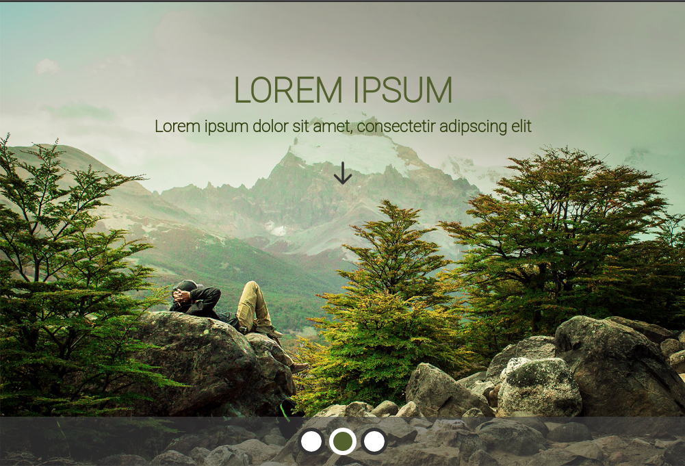

# DOT FrontEnd Teste

## Desafio

O Desafio foi desenvolver um front end a partir de arquivos PSD, sendo implementados com React e outro sem Framework. Este projeto é o frontend desenvolvido em React.

## O projeto

O projeto foi realizado com o React JS em conjunto com as bibliotecas:

* `Bootstrap`
* `Bootstrap React`

## Inicializando o projeto

Para rodar o projeto é necessário realizar alguns passos

1. Clone o projeto `git clone https://github.com/cdbarbosa/startwars`
2. `yarn install` ou `npm install` para instalar os pacotes necessários
3. `yarn start` ou `npm start` para iniciar o projeto. O projeto irá iniciar em [http://localhost:3000](http://localhost:3000)

## Considerações finais

A implementação do frontend foi utilizando as classes e estilos do Bootstrap, além de implementação de CSS. Apesar de contemplar o pedido proposto pelo desafio, ainda poderia ter sido implementado algumas animações.

## Implementações Futuras

* Animações de componentes
